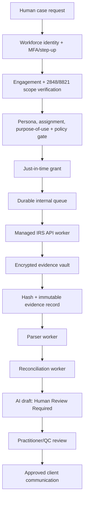

# Internal IRS Account Evidence & Transcript Operations

Status: starter architecture, synthetic-data only, live IRS connectivity disabled by default.

## System boundary

This module is strictly internal. It does not expose a public taxpayer search, refund lookup, transcript lookup, public taxpayer dashboard, or external developer API for taxpayer data.

Authoritative dataset name: **Authorized IRS Account Evidence Dataset**. It is not an IRS Master File replica, not IDRS, and not a substitute for the official IRS record.

## Architecture

## Human-gated flow

Human request → identity/engagement/authority verification → employee/persona eligibility → case purpose validation → approval gate → managed worker execution → encrypted evidence vault → parsing/reconciliation → AI draft → practitioner/QC review → approved communication.

## Internal UI inventory

- Tax Operations Command Center
- IRS Data Request Queue
- Request Preflight Detail
- Authorization Scope Verification
- Evidence Vault Metadata View
- Transcript Parsing Review
- Reconciliation Workspace
- TC 570/810/846 Monitoring Queue
- AI Draft Review
- Communication Approval Queue
- Worker Health / Dead Letter Queue
- Compliance & Audit Evidence Dashboard
- Credential / Certificate Expiration Dashboard
- Kill Switch / Release Controls

## Release gate

Live retrieval remains disabled until formal product authorization, registered client credentials, tested Form 2848/8821 verification, workforce/persona checks, service-scoped worker permissions, encrypted evidence handling, pre-call audit linkage, tenant isolation tests, rate/idempotency/kill-switch tests, and recorded Compliance/Security/Tax Operations/Executive approval are all complete.
